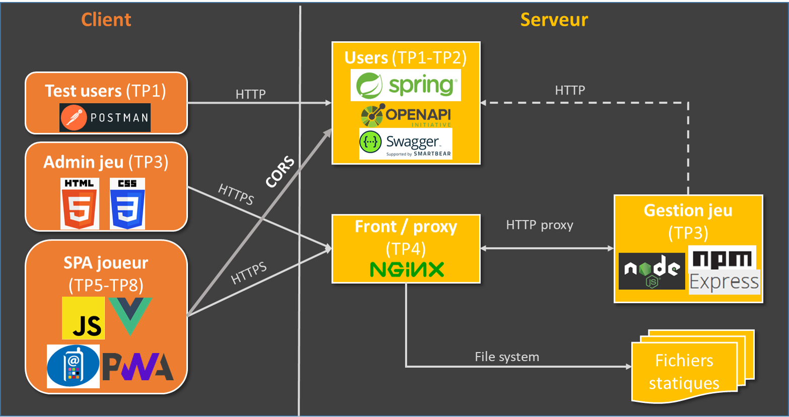

# M1if13 2023

Ce dépôt contient les énoncés et le code de base des TPs de l'UE "Web Avancé, Web Mobile" de M1 informatique, pour le second semestre 2022-2023.

## Principe général de l'UE

Voici le programme* des TPs :

- **Bloc 1 : prog. serveur avancée en Java**
  - 13/02 : [framework côté serveur (Spring Boot)](users)
  - 22/02 : conception et spécification d'une API (annotations OpenAPI)
- **Bloc 2 : prog. serveur en JS**
  - 15/03 : stack JS (Node, Express, Webpack, EsLint)
  - 22/03 : infrastructure (déploiement sur OpenStack, requêtage en CORS)
- **Bloc 3 : prog client avancée**
  - 12/04 : framework côté client (VueJS)
  - 19/04 : state management pattern (VueX)
- **Bloc 4 : Web mobile**
  - 10/05 : utilisation des capteurs et actionneurs du client (Device APi)
  - 17/05 : Progressive Web Apps (PWA)
- **Bloc 5 : dernières optimisations et démos**
  - 07/06 : Web Assembly (WASM)
  - 14/06 : CCF + Démos

## Architecture générale de l'application

## TP1 & TP2 : framework côté serveur (Spring Boot)
// TODO
 - lien fichier yaml sur le dépôt.
 - Swagger généré par Spring et déployé sur la VM.
