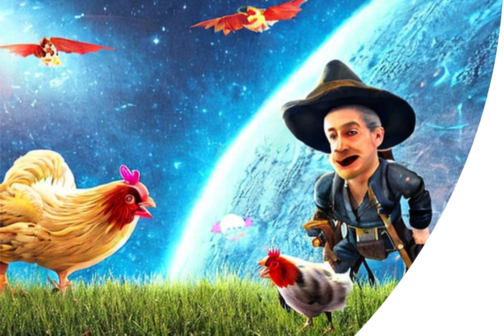
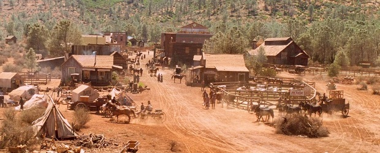
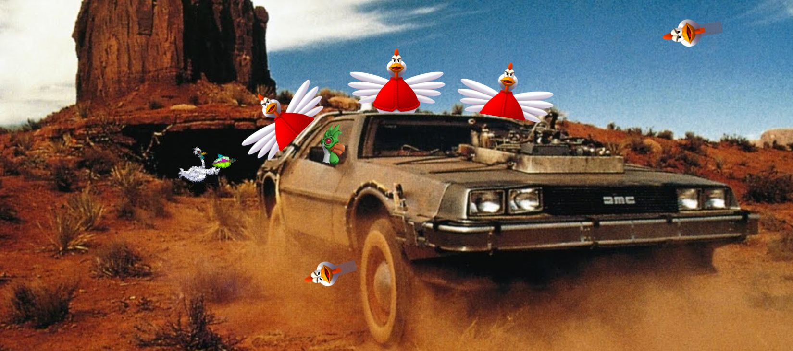
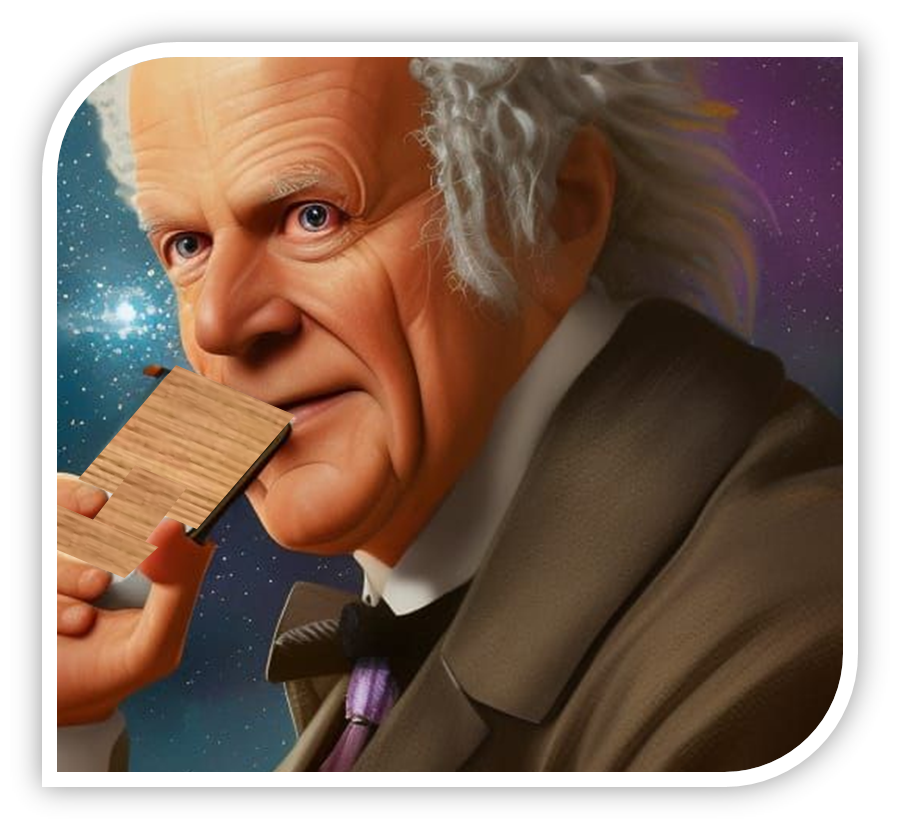

# Les Poules et les Cow-boys : une ruée vers l'or intergalactique

Nous sommes vers la fin du XIXeme siècle à l'ouest des &Eacute;tats-Unis. Plus précisément, dans le comté de Zuxton, où suite à la crue de la rivière proche, la mine d'or locale vient d'être inondée. Les mineurs ont eu juste le temps de s'enfuir, laissant sur place une grande quantité du précieux minerai qu'ils venaient d'extraire. La crue, d'une ampleur exceptionnelle, a recouvert d'un lac de boue la plaine environnante sur plusieurs miles carrés. Lorsque la rivière s'est finalement retirée et a regagné son lit, la mine était vide ; les flots avaient tout emporté et disséminé sur la plaine argileuse. L'or étant plus dense que la terre, la plupart des pépites ont été englouties jusqu'à parfois un mètre de profondeur, produisant une curieuse réaction chimique...

La population de la ville voisine, _Rapid City_, a ramassé tout ce qui a pu l'être après la crue et s'en est allé le dépenser dans des contrées plus civilisées. La société d'exploitation minière _Zuxton & Rapid Research_ Corp. (ZRR) a fini par faire faillite et fermer ses portes. Privée de sa principale source de richesses, Rapid City, qui tenait son nom de la vitesse avec laquelle elle a été érigée, s'est - rapidement - dépeuplée et transformée en no man's land. Elle attire désormais les pires desperados et autres cow-boys sans foi ni loi du pays, qui s'affairent à fouiller la terre et à se disputer les pépites éparpillées. Rapid City a été rebaptisée _Rope Town_, allusion au sort qui attend la plupart de ses nouveaux habitants.

Deux siècles plus tard, la Terre est envahie par une curieuse espèce extra-terrestre : les Poules Intergalactiques. Celles-ci cherchent en particulier à s'emparer d'une espèce de céréale nommée _goldingue_, réputée posséder le pouvoir de leur faire pondre des oeufs en or, ou _a minima_ posséder un effet psychotrope suffisamment puissant pour le leur faire croire. Malheureusement pour elles, la goldingue n'a poussé que dans la plaine du comté de Zuxton, suite à l'ensevelissement de l'or de la mine.

Malgré un quotient intellectuel limité, les Poules Intergalactiques comprennent assez vite qu'elles arrivent un peu tard pour piller les ressources de la Terre, et surtout que la goldingue a déjà été entièrement consommée cent ans plus tôt par des cow-boys avides de sensations - bien qu'infoutus de pondre un oeuf - et que tout l'or de la plaine a été déterré entre temps, empêchant le renouvellement de la préciseuse semence.

Elles décident donc de faire un saut temporel en arrière pour aboutir à l'époque de nos cow-boys. Pour cela, elles réussissent à détraquer le convecteur spatio-temporel de la DeLorean du Dr. Emmett Brown et à embarquer avec Marty McFly pour se retrouver en 1885, l'année suivant la crue et où la goldingue a commencé à pousser. Leur plan est simple : sécuriser la l'ensemble de la concession de la ZRR, récolter la goldingue et la renvoyer en 2085 par la DeLorean. Mais les cow-boys ne l'entendent pas de cette oreille...

Les cow-boys (et cow-girls) s'empressent au maximum de ramasser des plants de goldingue et de déterrer les pépites d'or qui sont au-dessous. Les poules, de leur côté, ne s'intéressent qu'à la goldingue, et érigent, à une vitesse record, des nids qui leur permettent de barricader les plants de goldingue, et donc aussi les pépites. En voyant cela, les cow-boys ont bien essayé de se débarrasser des poules, mais le voyage dans le temps les a rendu immatérielles pour eux. Réciproquement, les armes sophistiquées de la civilisation intergalactique des poules ne peuvent pas atteindre les cow-boys qui pillent "leurs" champs de goldingue. Poules et cow-boys peuvent donc se voir, se couvrir de noms d'oiseaux, mais pas s'atteindre, et en sont réduits à se ruer sur chaque nouveau plant de goldingue.

Les poules ont mis au point un détecteur très sensible capable d'indiquer l'apparition d'un plant sur la carte de la plaine. Fières de leur invention et de la supériorité qu'elle leur apporte, elles sont allé caqueter devant les cow-boys pour les narguer. Elles n'avaient pas réfléchi au fait que le détecteur n'ayant pas voyagé dans le temps, les cow-boys pourraient parfaitement s'en emparer. Ce qui fut le cas. Les deux espèces sont maintenant munies de détecteurs, et la ruée vers la goldingue a donc repris de plus belle.

&Agrave; dire vrai, les poules ne sont pas suffisamment malines pour concevoir quoi que ce soit. Elles ont donc délégué la partie matérielle au Dr. Emmett Brown qui s'ennuyait ferme depuis qu'il avait arrêté ses voyages dans le temps. Celui-ci a donc créé des terminaux mobiles rudimentaires en bois et développé un système complexe de machines à vapeur pour les alimenter et les connecter. Comme il n'est toutefois pas expert en programmation, il a été convenu avec les poules que les détecteurs fonctionneraient avec les standards du Web, et qu'elles trouveraient quelqu'un d'autre pour s'en occuper.

C'est tombé sur vous. Votre mission, si vous l’acceptez, sera de développer d’une part une API permettant de mettre à disposition des poules (et donc aussi aux cow-boys) les informations sur la localisation des plants de goldingue mais aussi des autres utilisateurs de l'application, et d’autre part un client Web mobile leur permettant de faire usage de ces informations. Ce client sera déployé sur une VM à laquelle les détecteurs du Dr. Brown ont accès à ces clients à travers un VPN spatio-temporel. Il est à noter que cette mission comporte, en plus de ces deux objectifs, une partie confidentielle qui vous sera dévoilée plus loin.

## API (TP 3 & 4)

### Partie publique

Afin d’aider tous ces braves gens à mener efficacement leurs recherches, vous développerez une API fournissant les informations suivantes :

- Limites de la ZRR
- Points d'apparition des plants de goldingue, avec leurs TTL (voir plus loin)
- Positions et espèces des individus dans la ZRR
- Positions des nids bloquant l'accès aux plants et aux pépites
- Nombre de pépites amassées par un cow-boy
- Nombre de nids érigés par une poule

### Partie confidentielle

Depuis l'invasion de la Terre par les Poules Intergalactiques, un gouvernement de coalition dit "Gallinaço-Humain" (GC) a été mis en place pour maintenir un _statu quo_ entre les deux espèces qui dominent la Terre. Puis, par souci d'anti-spécisme, l'assemblée a été ouverte à d'autres espèces, où ont notamment été élus des canards, quelques chèvres, un ver de terre et un mammouth récemment cloné. Pour éviter les catastrophes, les carnivores non-humains n'ont pas eu le droit de siéger. Les débats y sont assez cacophoniques mais pour ne pénaliser personne, il a finalement été décidé de confier la régulation de votre application à une commission constituée de singes savants.

&Agrave; l'aide de la partie confidentielle de l'application, les singes pourront à loisir :

- Fixer les limites de la ZRR
- Inscrire les individus (cow-boys ou poules) autorisés à utiliser l'application
- Surveiller leurs positions et accéder aux historiques de leurs actions
- Fixer le TTL des plans de goldingue : suite aux premiers tests, il est apparu que les singes s'ennuient rapidement et qu'il fallait dynamiser l'application pour les distraire un peu. Il a donc été décidé d'introduire, sous le prétexte fallacieux que la goldingue se fane vite, un délai maximum pour atteindre un plan, avant qu'il disparaisse de la carte. Ce délai a été baptisé par les singes _Temps de Tourner en Long_, ou TTL.
- Déclencher l'apparition d'un plant de goldingue, puisque tout cela est une vaste fumisterie et que les services secrets sous-terrains contrôlés par le ver de terre sont capables d'en faire apparaître à volonté.

## Client Web (TP 5 -> 8)

### Partie publique

Il vous est demandé de mettre à disposition des poules et des cow-boys un client aussi ergonomique et agréable à utiliser que possible, les informant avec précision de leur position, de celle des autres utilisateurs, ainsi que de celle des plants de goldingue (avec leurs TTL) et des nids. Ils pourront visualiser tout cela sur une carte montrant les limites de la ZRR. Pour pouvoir l’utiliser, ils devront s’identifier sur le serveur d’authentification centralisée de la Terre (que vous avez réalisé aux TPs 1 et 2).

### Partie confidentielle

En plus des fonctionnalités de ce client, vous devrez aussi réaliser une interface de consultation et de modification des données réservée aux Singes Savants (vos enseignants) pour leur permettre d’utiliser les fonctionnalités de la partie réservée de l’API. Bien entendu, seuls ces utilisateurs y auront accès à travers une interface "back-office" séparée du client mobile.